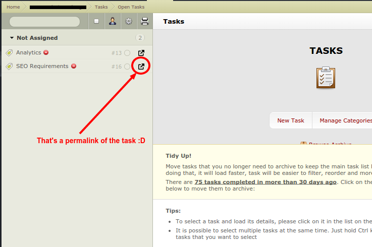

ac-link
=======
[ActiveCollab](https://www.activecollab.com/) is nice. I'm not here to argue about it's strengths and weaknesses, because at the end of the day it's avery handy tool.   

  
BUT...
=====

Don't you hate it when you try to open a task in a new tab and you end up opening that task in the same tab, closing whatever was already opened (maybe an unfinished comment :-1: ).  

   

I mean you do have the full task list on the left (as in the screenshot), but those items are not links... you can't even send a task link to a colleague because... you don't have access to any links!   
  
That sucks...  
Big time.  
    

[ac-link](https://github.com/gion/ac-link) chrome extension to the rescue!
=====

**ac-link** is a small (unpacked :( for now) extension that adds a small  icon on the right of each task that lets you:  

 - open that task in a new tab
 - copy the link of a certain task (without changing the page url :+1:)

install instruction
====

1. First you have to clone [this repo](https://github.com/gion/ac-link.git) or download the [latest release](https://github.com/gion/ac-link/releases) (and unzip the contents).  
2. Go to [chrome's extensions page](chrome://extensions/)
3. Turn on *Developer mode*
4. Click on the *Load unpacked extension...*
5. Browse to the **app** folder from the cloned/downloaded sources of this repo

known issues
====
It's an early *beta*, so there are issues, the most important ones being the fact that you have to [manually install/update the extension](https://github.com/gion/ac-link/issues/1) and the fact that [the extension only works on refresh](https://github.com/gion/ac-link/issues/2)

bugs & reports
====
Feel free to contribute by [issuing bugs/ideas(https://github.com/gion/ac-link/issues) or even make [pull requests](https://github.com/gion/ac-link/pulls?q=is%3Aopen+is%3Apr) 